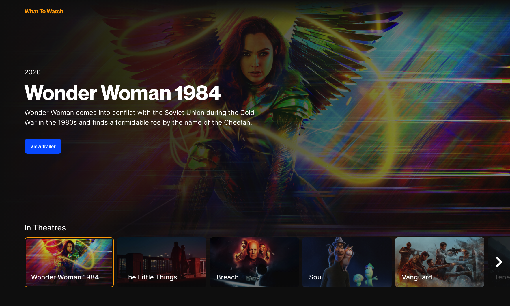

# What To Watch

Can't decide what movie or TV show you should watch next? Scrolling endlessly on Netflix to find something you like? No more! What To Watch is Single Page Application built with Vanilla JS, that allows you to binge watch all of the latest and greatest trailers to find that perfect match with ease.




<!-- Maybe a table of contents here? 📚 -->

<!-- How about a section that describes how to install this project? 🤓 -->

<!-- ...but how does one use this project? What are its features 🤔 -->

<!-- What external data source is featured in your project and what are its properties 🌠 -->

<!-- Maybe a checklist of done stuff and stuff still on your wishlist? ✅ -->

<br>

## Live demo
[Click here](https://what-to-watch-lime.vercel.app/) to see the application in action.

<br>

## How to use
This project has no dependencies and is built with Vanilla JS.

1. [Download](https://github.com/gv-minorweb/what-to-watch/archive/master.zip) or clone the repository.
2. Start a local server and navigate to the src directory in your browser.
_If you're using VS Code I recommend using [Live Server](https://marketplace.visualstudio.com/items?itemName=ritwickdey.LiveServer)._

<br>

## Actor & Interface Diagrams

To get a good grasp of the structure and flow of this application, please refer to the actor and interface diagrams below. They are used to visualize where the code lives and how interaction between the user, the application and all it's components take place.

<details>
<summary>View Actor Diagram</summary>


</details>

<details>
<summary>View Interface Diagram</summary>


</details>

<br>

## Methodologies

### Atomic Design
Whenever I start a new project, I lay out the foundation first and think about how I can make things as structured and easy to understand as possible. Whether I'm building a small one pager or an enterprise app, scalability is key and that applies to the way code is written as well. This app is structured using Brad Frost's [atomic design](https://bradfrost.com/blog/post/atomic-web-design/) principles.

Atomic design is a methodology for creating design systems, it splits up the application in five distinct levels:

1. Atoms
2. Molecules
3. Organisms
4. Templates
5. Pages

The basic idea is that your application is made up of pages, which are made up of organisms, which in turn utilize molecules that are made up of atoms.

#### About each level:

<details>
<summary>Atoms</summary>
Atoms are the smallest building blocks of the interface. Atoms are small elements such as a button, an input or a heading, that are meant to be reused further up the tree, more about this below. They generally don't include any of the logic of your application.
<br><br>
</details>

<details>
<summary>Molecules</summary>
Molecules are the next level up from Atoms and can be a little more complex. They are made up of groups of atoms, for example a form molecule that's made up of atoms such as inputs, labels and buttons.
<br><br>
</details>

<details>
<summary>Organisms</summary>
Organisms are groups of molecules joined together to form a distinct section of an interface.
<br><br>
</details>

<details>
<summary>Pages</summary>
<br><br>
</details>

---

### BEM

Another principle or methodology I like to use is [BEM](http://getbem.com/), which stands for **B**lock **E**lement **M**odifier. It helps create reusable components and is designed to be modular and flexible.

On the surface, BEM is nothing more than a naming convention and can be applied to a wide range of different projects. It ensures that everyone who participates in the development of a single codebase speaks the same language and makes sure code is written in a consistent manner.

Often you would use either Atomic Design or BEM, but as mentioned earlier, BEM is flexible and can be applied on top of other methodologies, so I'm combining the two in this project.

**So what are Blocks, Elements and Modifiers?**

<details>
<summary>Block</summary>

A standalone entity that is meaningful on its own.   For example: `header`, `button`, `card`.

</details>

<details>
<summary>Element</summary>

A part of a block that has no standalone meaning and is semantically tied to its block. For example: `header__nav`, `button__text`, `card__header`.

</details>

<details>
<summary>Modifier</summary>

A flag on a block or element and is used to change the appearance or behavior. For example: `header--small` or `card--big`.

</details>

<br>

Naming conventions with BEM are flexible, but the most common notation and the one that's used in this project, is two underscores for elements (`BLOCK__ELEMENT`) and two dashes to indicate something is a modifier (`BLOCK--MODIFIER`). It's important that whatever naming convention you use stays consistent throughout the project.

#### So how is this used in practice, in this project?

<details>
<summary>View example</summary>
One of the components in this project is a modal, an organism. I use BEM's naming convention for the classes of the elements the component is made up of.

```html
<!-- The "modal" is the block -->
<div class="modal">
  <!-- Elements inside a block -->
  <div class="modal__inner">
    <div class="modal__inner__header"></div>
    <div class="modal__inner__content"></div>
  </div>
  <div class="modal__bg"></div>
</div>
```
Let's say 90% of the modals in the application use a specific width and height, but there is one case where the modal needs to be full width. This is where the **modifier** of BEM comes in. For example:
```html
<div class="modal modal--fullwidth> ... </div>
```

</details>

<br>

## API - Getting Data
This application uses data from [TheMovieDB](https://developers.themoviedb.org/3/) (TMDB).
TMDB offers lots of endpoints of which I've used two in this application. One to get the movies that are in theatres now and one to get videos (trailers) of a specific movie.

**API URL:** `https://api.themoviedb.org/3/`

To get data from an endpoint, call the `getData()` function that requests data from a specific endpoint, located in [src/js/modules/api.js](src/js/modules/api.js).

Application level authentication on version 3 of the API is controlled by a single query parameter, `api_key`. Register your own API key at [TMDB]() and replace `<<api_key>>` with it.

Example request:
`https://api.themoviedb.org/3/movie/76341?api_key=<<api_key>>`

### Caching
To prevent too many requests being made I implemented a localStorage caching solution that saves retrieved data in localStorage after making a call. If data from an endpoint already exists locally, the data will be fetched from there instead of making a request to the external API.

**Please note**, the current implementation does not check if the value that's stored locally is valid JSON and matches the correct data schema and should not be used in production until those checks are added.

<br>

### Get movies that are out now
_Get a list of movies in theatres (playing now)._

- #### Request:
`GET /movie/now_playing`
```js
const data = await getData('movie/now_playing')
```
- #### Response:
Please view the response schema [here](https://developers.themoviedb.org/3/movies/get-now-playing).

<br>

### Get movie details
_Get the primary information about a movie.
Supports `append_to_response`._

_The movie, TV show, TV season, TV episode and person detail methods support a query parameter called append_to_response. This makes it possible to make sub requests within the same namespace in a single HTTP request. Each request will get appended to the response as a new JSON object._

- #### Request:
`GET /movie/{movie_id}`
```js
const data = await getData('movie/550')

// With append_to_response
const data = await getData('movie/550', 'videos')

// The secondary parameter can also be an array of strings
const data = await getData('movie/550', ['videos', 'images'])
```

- #### Response:
Please view the response schema [here](https://developers.themoviedb.org/3/movies/get-movie-details).


---

### To do

- [ ] Don't refresh the page if a modal is opened
- [ ] Make the slider interactive
- [ ] Check if data in localStorage is a valid JSON object and matches a schema
- [ ] Refresh local data based on cookie expiry (to be added)
