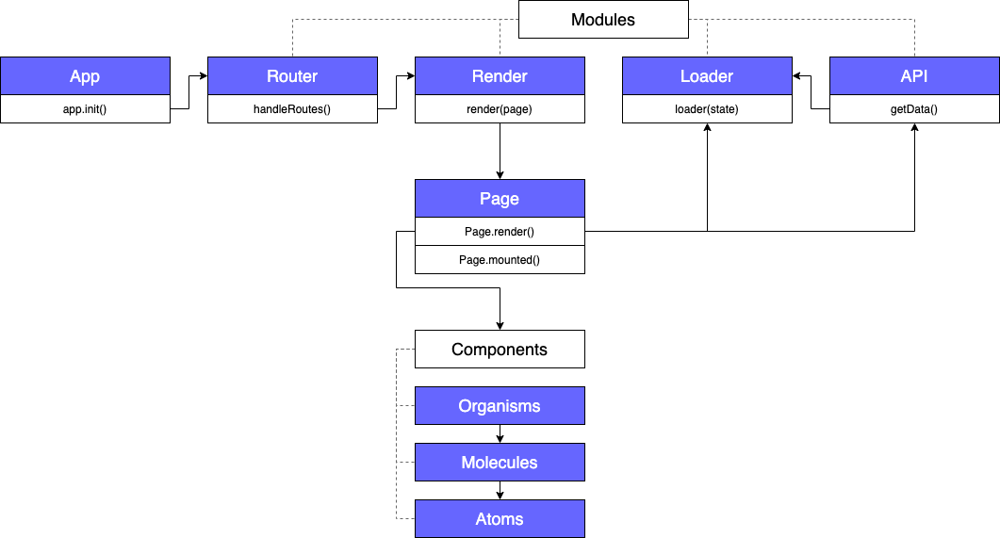
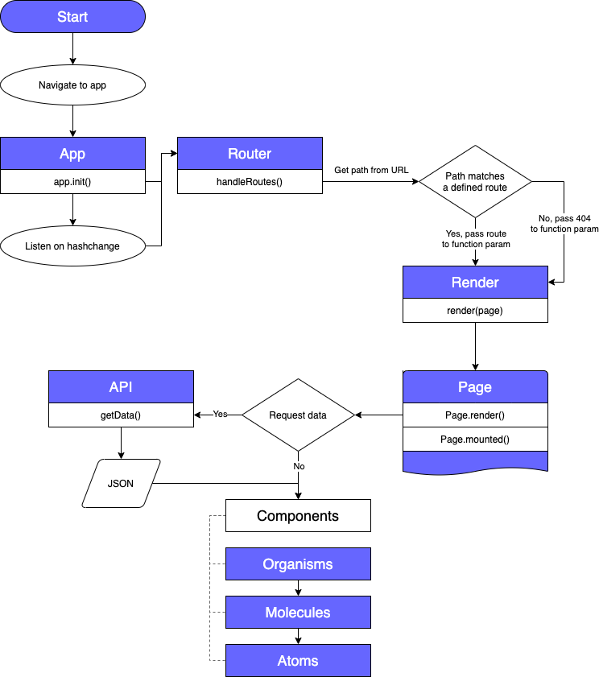

# What to watch?

Can't decide what movie or TV show you should watch next? Scrolling endlessly on Netflix to find something you like? No more! This application allows you to binge watch all of the latest and greatest trailers to find that perfect match with ease.

<!-- Add a link to your live demo in Github Pages 🌐-->

<!-- ☝️ replace this description with a description of your own work -->

<!-- replace the code in the /docs folder with your own, so you can showcase your work with GitHub Pages 🌍 -->

<!-- Add a nice poster image here at the end of the week, showing off your shiny frontend 📸 -->

<!-- Maybe a table of contents here? 📚 -->

<!-- How about a section that describes how to install this project? 🤓 -->

<!-- ...but how does one use this project? What are its features 🤔 -->

<!-- What external data source is featured in your project and what are its properties 🌠 -->

<!-- Maybe a checklist of done stuff and stuff still on your wishlist? ✅ -->

## Actor diagram

## Actor diagram

<!-- How about a license here? 📜 (or is it a licence?) 🤷 -->
